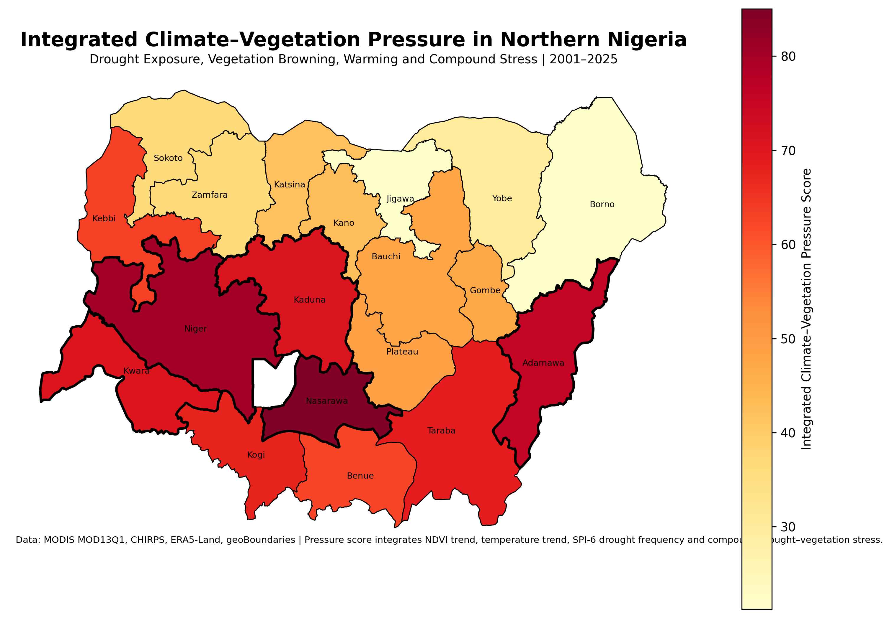
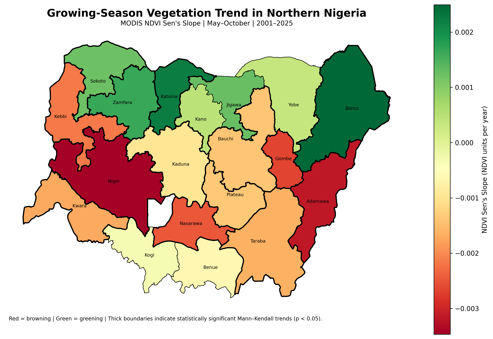
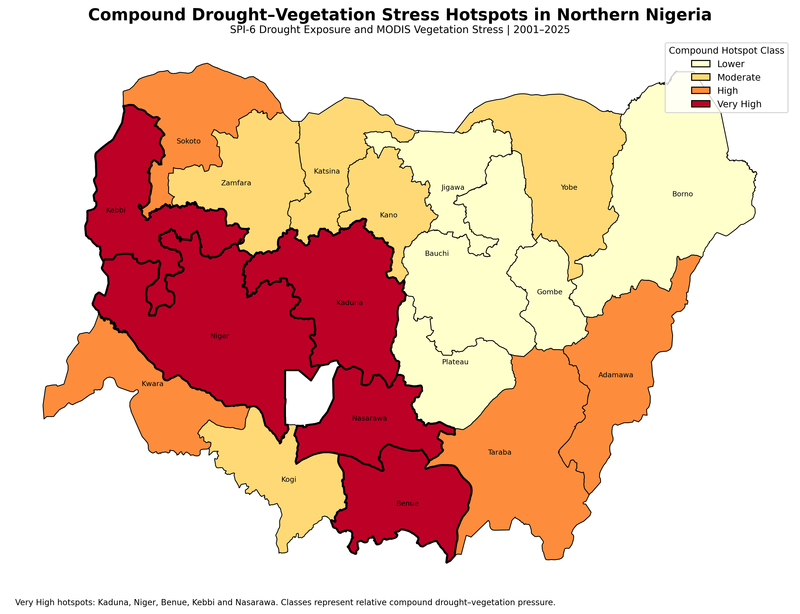
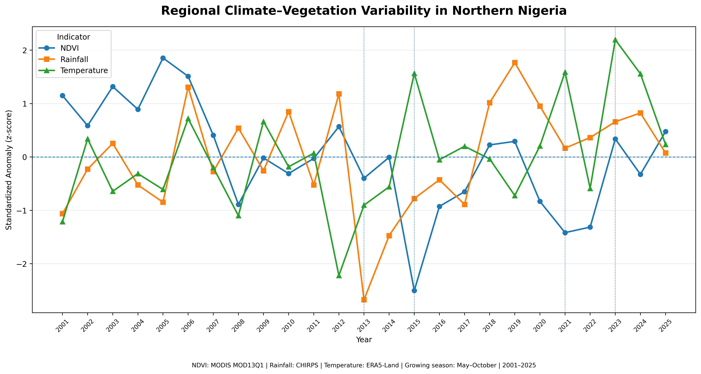
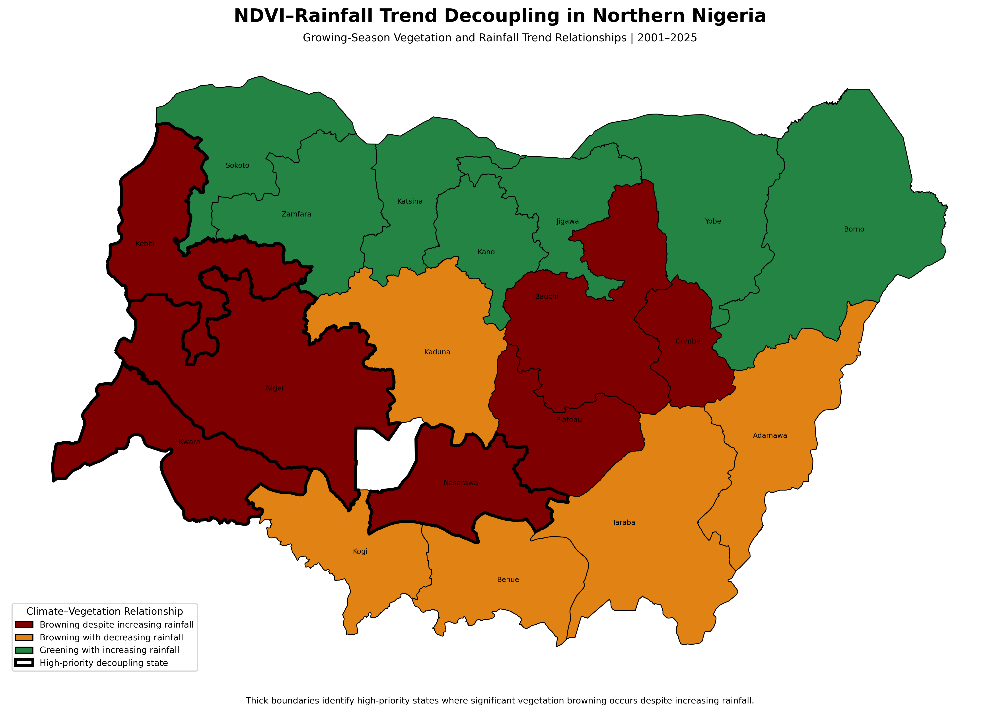

# Drought and Vegetation Stress Monitoring — Northern Nigeria

**A multi-source time-series assessment of drought exposure, vegetation condition and long-term climate–vegetation dynamics across 19 northern Nigerian states.**

<p align="center">
  
</p>

Northern Nigeria is highly exposed to rainfall variability, rising temperatures and vegetation stress, yet no single indicator captures the full pattern of environmental pressure. This project integrated MODIS NDVI and EVI, CHIRPS precipitation, ERA5-Land temperature and state-level spatial statistics to evaluate drought and vegetation dynamics from **2001 to 2025**. A longer **1981–2025 CHIRPS climatology** supported rainfall-anomaly and Standardized Precipitation Index analysis.

The regional growing-season NDVI trend declined significantly at **−0.000777 per year** (*p* = **0.0085**), while EVI declined by **−0.000358 per year** (*p* = **0.0413**). Growing-season temperature increased significantly by **0.0154 °C per year** (*p* = **0.0288**), equivalent to approximately **0.37 °C** across the study period. May–October rainfall increased by **2.50 mm per year**, but the trend was not statistically significant (*p* = **0.2012**).

The state-level results show that **10 of 19 states** experienced significant NDVI browning, **9 states** experienced significant warming and **4 states** recorded significant rainfall increases. **2015** was the most spatially extensive compound drought–vegetation stress year, affecting **12 states**. Seven states showed vegetation browning despite increasing rainfall, indicating that seasonal rainfall totals alone do not explain the observed decline in vegetation condition.

| Project detail | Information |
|---|---|
| **Study area** | 19 states across North Central, North East and North West Nigeria |
| **Vegetation data** | MODIS MOD13Q1 V6.1 NDVI and EVI |
| **Rainfall data** | CHIRPS Daily |
| **Temperature data** | ERA5-Land Monthly Aggregated |
| **Primary period** | 2001–2025 |
| **Rainfall climatology** | 1981–2025 |
| **Core methods** | Anomalies, VCI, SPI-3, SPI-6, Mann–Kendall, Sen's slope and hotspot ranking |

## Key findings

- Regional growing-season **NDVI declined significantly** at **−0.000777/year**.
- Regional **EVI declined significantly** at **−0.000358/year**.
- Growing-season temperature increased significantly at **+0.0154 °C/year**.
- May–October rainfall increased by **+2.50 mm/year**, but the trend was not statistically significant.
- **Niger State** recorded the strongest NDVI browning: **−0.003468/year**.
- **Borno State** recorded the strongest significant greening: **+0.002495/year**.
- **Kogi State** recorded the strongest warming: **+0.0325 °C/year**.
- **2015** was the most widespread compound drought–vegetation stress year.
- **Nasarawa** ranked highest in integrated climate–vegetation pressure: **85.01**.
- **Kaduna** ranked highest in compound drought–vegetation hotspot intensity: **80.23**.
- **North Central Nigeria** had the highest geopolitical-zone pressure score: **69.17**.

## Analytical workflow

1. Prepared and quality-checked the 19-state study boundary.
2. Applied MODIS QA masking using `SummaryQA <= 1`.
3. Generated monthly, annual and May–October NDVI/EVI composites.
4. Aggregated CHIRPS rainfall and established a 1981–2025 climatology.
5. Derived rainfall anomalies, SPI-3 and SPI-6 drought indicators.
6. Calculated vegetation anomalies and Vegetation Condition Index.
7. Combined drought and vegetation stress at state-year level.
8. Applied Mann–Kendall trend tests and Sen's slope estimation.
9. Assessed rainfall–vegetation and temperature–vegetation relationships.
10. Ranked states and geopolitical zones by integrated climate–vegetation pressure.

## Selected outputs

### Integrated climate–vegetation pressure



### Growing-season NDVI trend



### Compound drought–vegetation hotspots



### Climate–vegetation time series



### NDVI–rainfall trend decoupling



## Planning interpretation

The results support drought early warning that combines rainfall deficits, vegetation anomalies and temperature stress rather than relying on rainfall alone. North Central Nigeria requires particular attention because it combines widespread vegetation browning, consistent warming and high integrated pressure.

States showing vegetation decline despite stable or increasing rainfall need additional investigation of land-use change, soil degradation, grazing pressure, cultivation intensity and rainfall timing. The integrated rankings are project-specific planning diagnostics, not internationally standardised drought indices, and the climate–vegetation associations should not be interpreted as proof of direct causation.

## Repository structure

```text
.
├── assets/                  # Cover and social preview
├── data/processed/
│   ├── gis/                 # Selected final spatial layers
│   ├── tables/              # Trend, ranking and planning tables
│   └── time_series/         # Regional climate and vegetation series
├── docs/                    # Sources, methods, results and limitations
├── notebooks/               # Results-review notebook
├── outputs/
│   ├── maps/                # Six final maps
│   └── charts/              # Six analytical charts
├── scripts/python/          # Result-reproduction script
├── validation/              # Repository validation
├── CITATION.cff
├── LICENSE
├── README.md
├── project.json
└── requirements.txt
```

## Reproducibility

The repository publishes the final analytical evidence, selected GIS layers, time-series tables and scripts that validate the headline results. Source satellite and climate collections are accessed through Google Earth Engine and are not redistributed.

```bash
pip install -r requirements.txt
python scripts/python/reproduce_summary.py
python validation/validate_repository.py
```

## Author

**Abdullah Abdazeez Ayomide**  
Geo-spatial Planner | GIS & Remote Sensing Analyst

- [GitHub](https://github.com/Abdullahabdazeez)
- [LinkedIn](https://ng.linkedin.com/in/abdazeez-abdullah-4b814719a)
- [Email](mailto:abdazeezabdullah1@gmail.com)

## Citation and licence

Citation metadata is provided in [`CITATION.cff`](CITATION.cff). Code and original documentation are released under the MIT License. External datasets retain their providers' original licences and terms.
