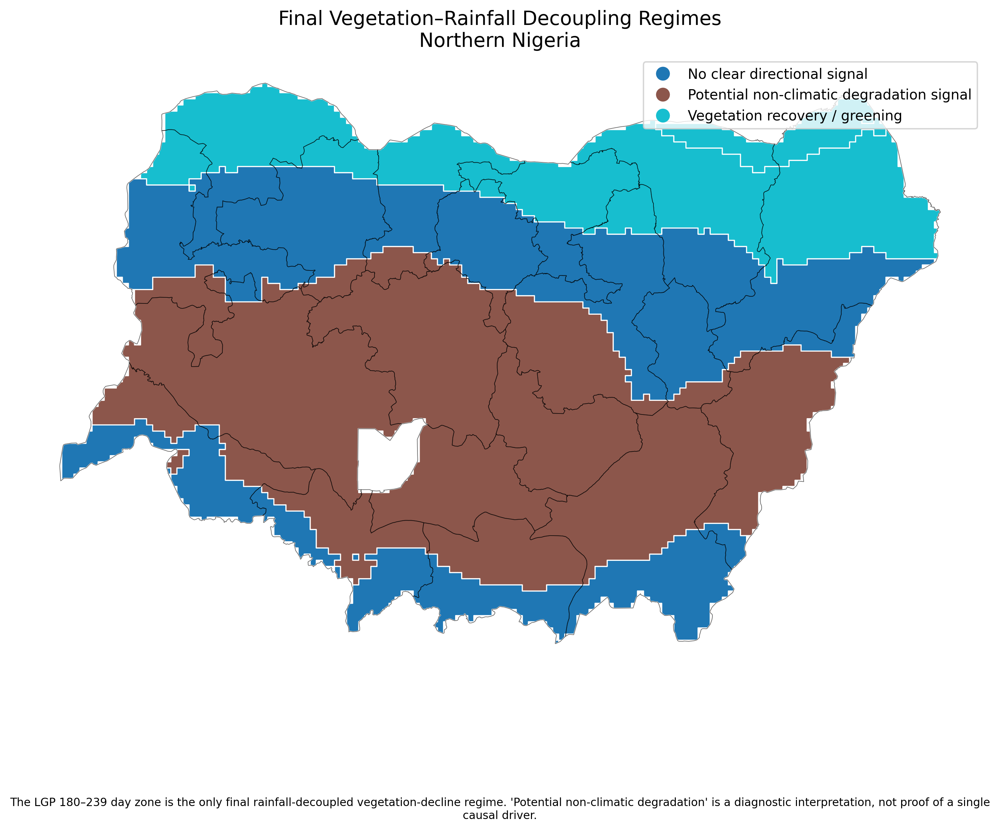
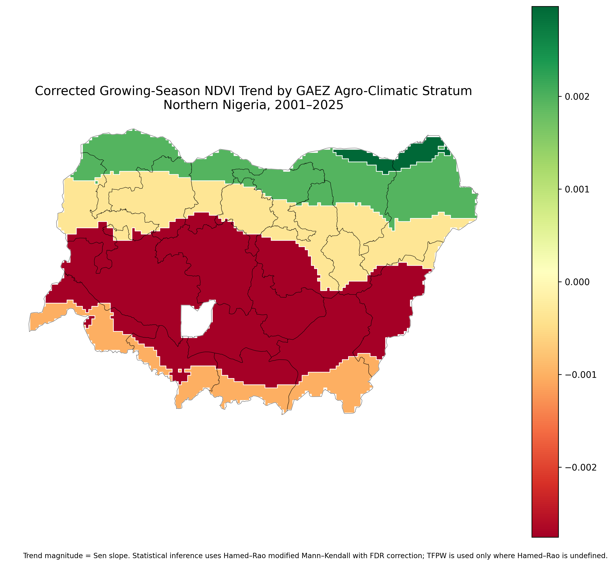
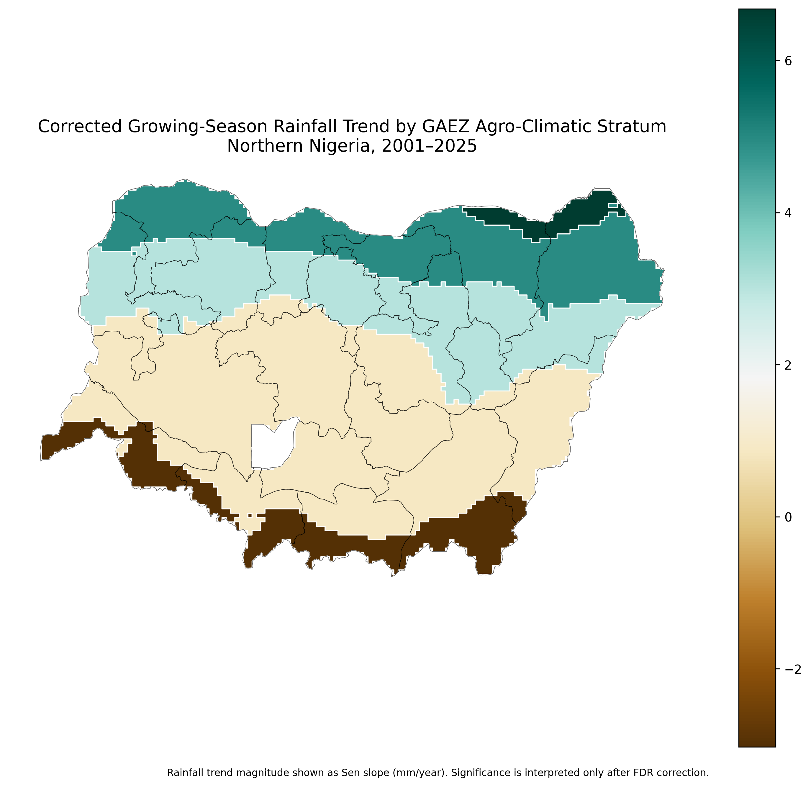
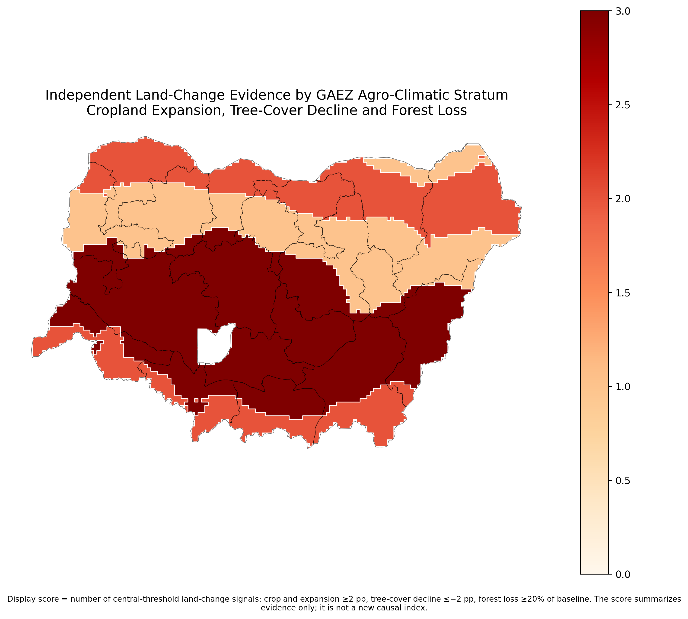
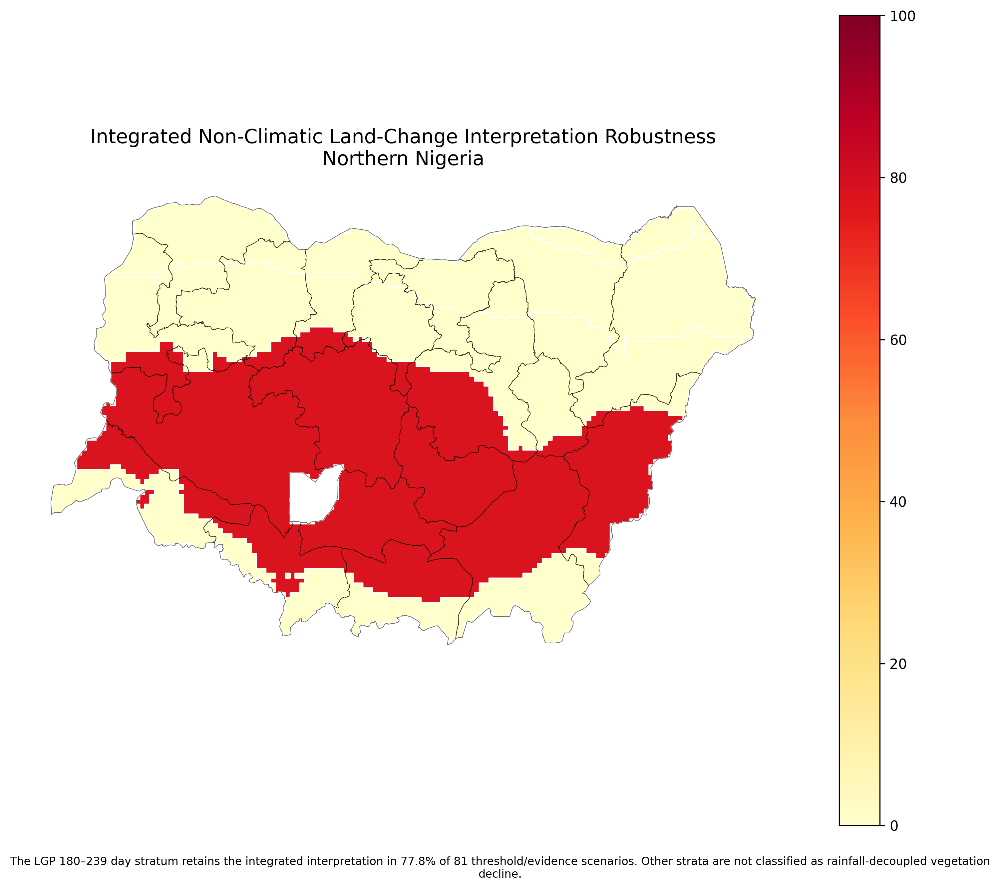

# Vegetation Browning Beyond Climatic Drought in Northern Nigeria

  

## What this project asks

When vegetation becomes less green over time, is declining rainfall always the reason?

I used **2001–2025** vegetation and rainfall records across Northern Nigeria to look for places where vegetation decline is statistically clear but rainfall does not show the same downward trend. I then compared those areas with independent land-cover and forest-loss evidence.

The main finding is that one agro-climatic zone shows a strong vegetation decline **without a matching rainfall decline**, which means it would be too simple to describe the pattern as climatic drought alone.

## Why I used agro-climatic zones

Instead of grouping the analysis only by state boundaries, I used **length of growing period (LGP)** zones. These follow the ecological and moisture gradient more closely and reduce the risk of hiding environmental patterns inside administrative averages.

The five occupied zones are:

- LGP <60 days
- LGP 60–119 days
- LGP 120–179 days
- LGP 180–239 days
- LGP 240–299 days

## Main finding

The **LGP 180–239 day zone** is the clearest vegetation–rainfall decoupling regime.

| Evidence | Result |
|---|---:|
| NDVI trend | **−0.002754 per year** |
| NDVI FDR-adjusted p | **0.000096** |
| EVI trend | **−0.001671 per year** |
| EVI FDR-adjusted p | **0.000849** |
| Rainfall FDR-adjusted p | **0.682538** |
| Cropland change | **+2.22 percentage points** |
| Tree-cover change | **−8.88 percentage points** |
| Forest loss | **1,123.1 km²** |
| Forest loss as share of baseline forest | **28.07%** |
| Interpretation retained across robustness scenarios | **77.8% of 81 scenarios** |

The vegetation decline is therefore statistically strong, while rainfall does not show a significant decline in the same target zone.

## Vegetation trend

  

## Rainfall trend

  

Looking at the two patterns together is important. A vegetation decline that happens alongside declining rainfall may support a climatic-drought interpretation. A vegetation decline without that rainfall signal needs a different explanation.

## Independent land-change evidence

  

In the target zone, cropland expands while tree cover declines, and the independent forest-loss dataset records substantial loss. Taken together, those signals are **more consistent with land-use and vegetation-cover change than with climatic drought alone**.

That is an association-based interpretation, not proof of a single cause.

## Statistical approach

I estimated trend size with **Sen/Theil–Sen slope**. Because environmental time series can be serially correlated, I used **Hamed–Rao modified Mann–Kendall** inference. Where Hamed–Rao was mathematically undefined, I used **trend-free prewhitening (TFPW) modified Mann–Kendall** as a documented fallback.

Multiple testing was controlled with the **Benjamini–Hochberg false discovery rate (FDR)** procedure.

This matters because an apparently significant trend can be misleading if serial correlation and repeated testing are ignored.

## Robustness

  

The integrated interpretation is retained in **77.8% of 81 tested scenarios**. I use that as evidence that the conclusion is not dependent on one narrow modelling choice.

## What this means for environmental planning

The project shows why vegetation browning should not automatically trigger a drought-only explanation. If rainfall is stable while vegetation declines and land-cover evidence points toward tree loss or agricultural expansion, the response may need to focus more on land management, vegetation protection and local land-use pressures.

Drought monitoring is still important; the point is that it should be interpreted together with land-cover evidence rather than in isolation.

## Important limitation

I do **not** make a final conflict-attribution claim in this project. The conflict dataset available during reconstruction was geographically restricted and was not representative enough of Northern Nigeria to support that conclusion.

## Data used

MODIS NDVI/EVI · CHIRPS rainfall · GAEZ growing-period zones · Dynamic World land cover · Hansen forest loss

## Repository contents

The final package contains five maps, six charts, authoritative result tables, GIS outputs, documentation and the technical report. Maps are in [`assets/maps`](assets/maps/), charts in [`assets/charts`](assets/charts/), and the report in [`reports`](reports/).

## Author

**Abdullah Abdazeez Ayomide**  
Geospatial Planner · GIS & Remote Sensing Analyst · Urban & Environmental Planning Researcher

[GitHub](https://github.com/Abdullahabdazeez) · [LinkedIn](https://ng.linkedin.com/in/abdazeez-abdullah-4b814719a)

## Citation

Abdullah Abdazeez Ayomide. *Vegetation Browning Beyond Climatic Drought: Agro-Climatic Trend, Rainfall Decoupling and Land-Change Evidence in Northern Nigeria*. Geospatial environmental-planning project, 2026.
